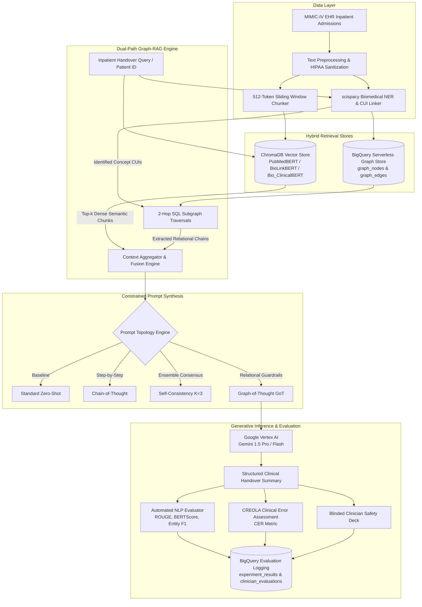

# Clinical Summarization KG-RAG: Architecture & Technical Documentation

Welcome to the comprehensive technical documentation for the **Clinical Summarization KG-RAG** research system. This repository contains the complete implementation of a neuro-symbolic, dual-path Retrieval-Augmented Generation (RAG) framework designed to eliminate clinical hallucinations and omissions during automated patient handover summarization.

---

## Architectural Overview

The core paradigm of this research is that purely continuous dense embeddings lack discrete relational awareness, while ungrounded autoregressive language models are prone to factual fabrication and high-risk omission. By coupling a dense vector index (ChromaDB with domain-specific biomedical embeddings) with an enterprise serverless Knowledge Graph (Google BigQuery storing UMLS concept triples), our hybrid engine enforces deterministic ontological constraints on generative Large Language Models (Google Vertex AI Gemini).

---

## Documentation Index

The technical guides in this directory provide granular, reproducible documentation covering every tier of the research system:

1. **[01. Experiment Setup and Environment Architecture](01_experiment_setup_and_architecture.md)**
   - Complete hardware, software, and cloud requirements.
   - Google Cloud Platform (GCP) infrastructure configuration: Vertex AI, BigQuery, and Google Cloud Storage (GCS).
   - Infrastructure-as-Code (Terraform) provisioning and security roles.
   - Local Python virtual environment, dependencies, and environment variable configuration.

2. **[02. Data Preprocessing and Ingestion Pipeline](02_data_pipeline_and_preprocessing.md)**
   - MIMIC-IV cohort selection criteria ( = 158$ inpatient hospital admissions).
   - Regex text normalization, HIPAA de-identification sanitization, and structured tokenization.
   - Biomedical Named Entity Recognition (NER) and UMLS CUI linking via `scispacy` (`en_core_sci_sm`).
   - Sliding window chunking (512-token windows, 64-token overlap).
   - Synthetic benchmark dataset generation utilities for offline and reproducible testing.

3. **[03. Knowledge Graph Engineering & BigQuery Implementation](03_knowledge_graph_construction.md)**
   - Ontological schema design: Concept Nodes (`cui`, `name`, `types`) and Typed Relational Edges (`cui_from`, `cui_to`, `rel_type`).
   - Clinical relationship whitelist (`TREATS`, `CAUSES`, `HAS_SYMPTOM`, `ASSOCIATED_WITH`, `CONTRAINDICATES`, `IS_A`).
   - High-performance bulk staging and atomic SQL `MERGE` ingestion pipelines.
   - Serverless 2-hop neighborhood expansion algorithms via recursive BigQuery SQL queries.
   - Architectural comparison: Serverless BigQuery vs. Graph Databases (e.g., Neo4j) for enterprise EHR scales.

4. **[04. Hybrid Graph-RAG Engine & Semantic Retrieval](04_graph_rag_retrieval_and_engine.md)**
   - Vector store implementation with persistent ChromaDB.
   - Empirical comparison of biomedical dense embedding encoders: Bio_ClinicalBERT vs. BioLinkBERT vs. PubMedBERT ( = 768$).
   - Dual-path retrieval orchestration: merging dense semantic similarity with multi-hop graph subgraphs.
   - Path linearization and textual graph context formatting.
   - Resilience patterns: deterministic mock fallbacks, exponential backoff, and offline execution modes.

5. **[05. Prompting Topologies and LLM Generation](05_prompting_topologies_and_generation.md)**
   - Detailed specification of all four prompting topologies:
     - Standard Zero-Shot
     - Chain-of-Thought (CoT)
     - Self-Consistency ( = 3, T = 0.7$ with pairwise ROUGE-L medoid selection)
     - Graph-of-Thought (GoT) with structured ontological relational paths.
   - Google Vertex AI Gemini 1.5 Pro / Flash parameter tuning and deterministic temperature constraints ( = 0.2$).
   - Strict guardrails against clinical omissions and contraindication hallucinations.

6. **[06. Evaluation Framework, CREOLA Metric & Statistical Benchmarks](06_evaluation_framework_and_benchmarks.md)**
   - Multi-metric evaluation battery: ROUGE-1/2/L, BERTScore F1, and core biomedical Entity F1.
   - The CREOLA (Clinical Reasoning and Error Ontology for LLM Assessment) framework and weighted Clinical Error Rate (CER) formulation.
   - Clinician review deck methodology ( = 100$ expert evaluations) and blinded 1–5 Likert safety scoring.
   - Statistical hypothesis testing implementation: Paired 569Xtests (RQ1), One-Way ANOVA with Tukey HSD (RQ2), Repeated Measures ANOVA (RQ3), and Spearman Rank Correlation (RQ4).
   - Automated publication chart generation (300 DPI) and LaTeX synchronization.

---

## Quick Reference Commands

| Task | Command |
| :--- | :--- |
| **Run Full E2E Pipeline** | `make run-pipeline` or `./setup_and_run.sh` |
| **Provision Cloud IaC** | `cd terraform && terraform init && terraform apply` |
| **Run Statistical Evaluation** | `python src/run_evaluator.py` |
| **Benchmark Embeddings** | `python src/evaluate_embeddings.py` |
| **Calculate Clinician Correlations** | `python src/clinician_correlation.py` |
| **Generate Publication LaTeX** | `make generate-latex` or `python src/latex_generator.py` |
